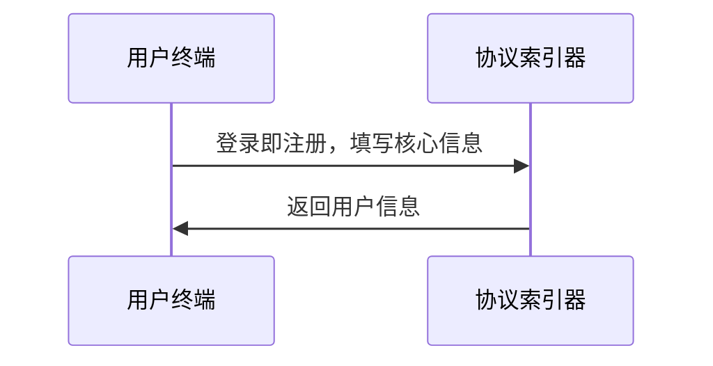
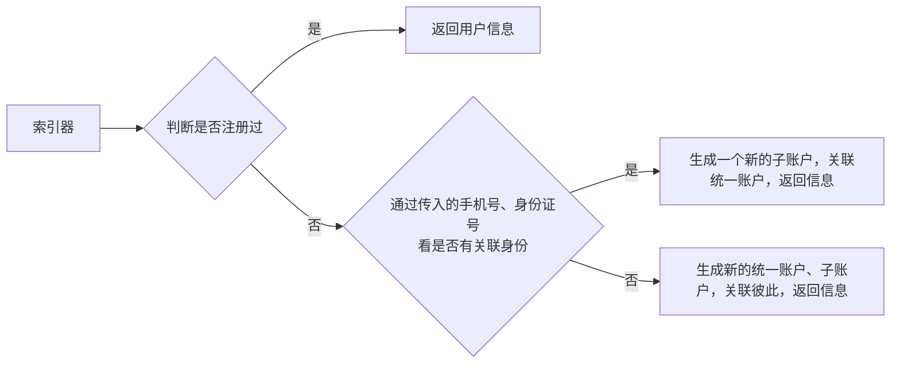
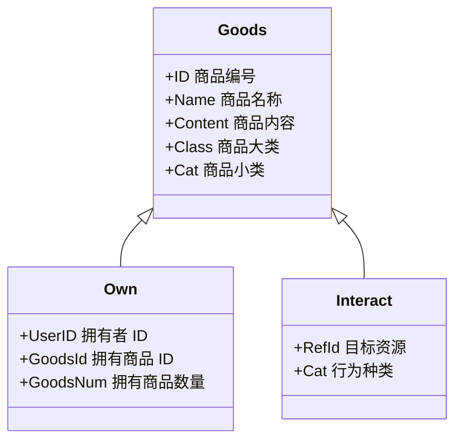

# 核心原理

深度社交协议将用户身份、内容、关系、金融等数据进行抽象，打包成一套开放易懂、开箱即用的后端服务与数据格式。

### 身份

对于一个普通用户，深度社交协议会产生一个“统一账号”（也称作“核心账号”、“根账号”），用户使用不同的生态应用时，会由统一账号生成子账号。通过这种机制，能够保证：

1. 所有用户数据会是统一联系的；
2. 各个生态应用能够独立进行身份识别、用户管理操作；

<figure><figcaption></figcaption></figure>

### 内容

在深度社交协议中，一切内容，例如一场活动、一篇文章、一篇论坛帖子、会员方案等都会按以下进行处理：

1. 内容商品化，在资源管理角度，他们被视为商品，可以确权、出售、转让；
2. 统一化技术实现，他们存在一张数据库表中，通过 ID （查单个）或 Class 和 Cat （查一种）进行访问；

数据库中，仅有关键的三张表，Goods、Own、Interact：

### 关系

深度社交协议采用“单向”社交关联方法，即“关注”。双向关注即是好友。判断、构建与删除用户的关系是回归统一账户的。

### 金融

深度社交协议的金融功能基于一套生态内部可流通的积分系统。允许一个组织生态按照自己逻辑发行积分，并设立积分商城。用户可以在积分商城中凭借手中积分购买任意商品。
