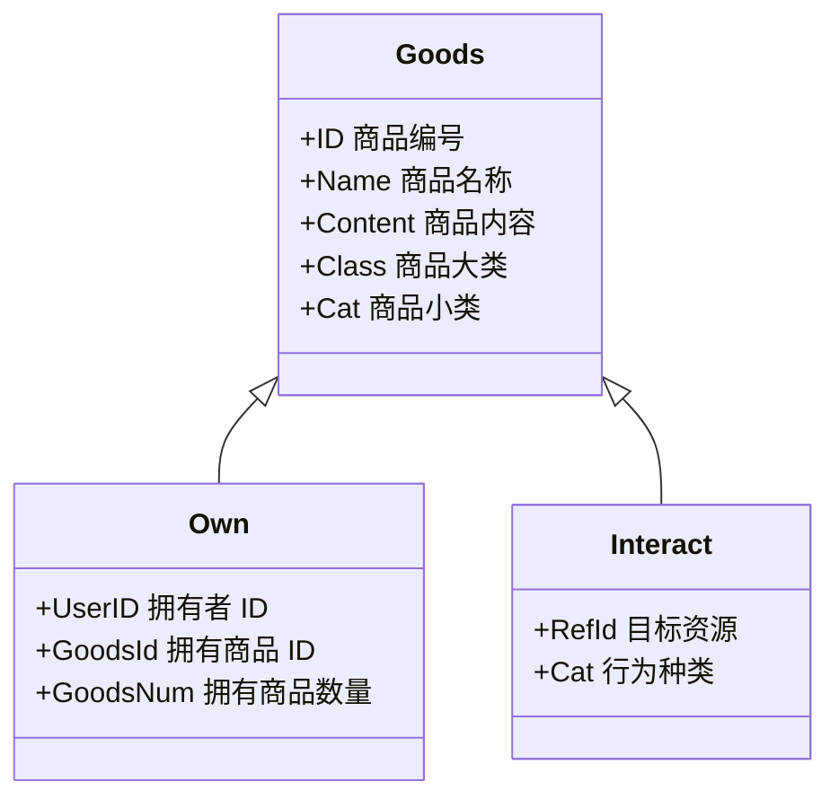

# 卡米坊

### 内容商品化

在深度社交协议中，一切内容，例如一场活动、一篇文章、一篇论坛帖子、会员方案等都会按以下进行处理：

1. 内容商品化，在资源管理角度，他们被视为商品，可以确权、出售、转让；
2. 统一化技术实现，他们存在一张数据库表中，通过 ID （查单个）或 Class 和 Cat （查一种）进行访问；

数据库中，仅有关键的三张表，Goods、Own、Interact：

### 积分流通

深度社交协议基于一套生态内部可流通的积分系统实现市场化，它允许一个组织生态按照自己逻辑发行积分，并设立积分商城。用户可以在积分商城中凭借手中积分购买任意商品。
