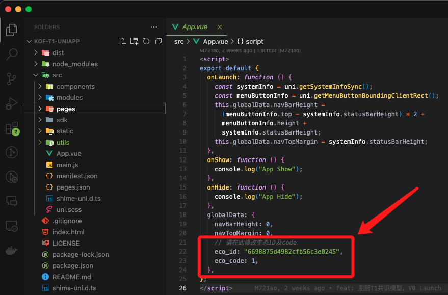
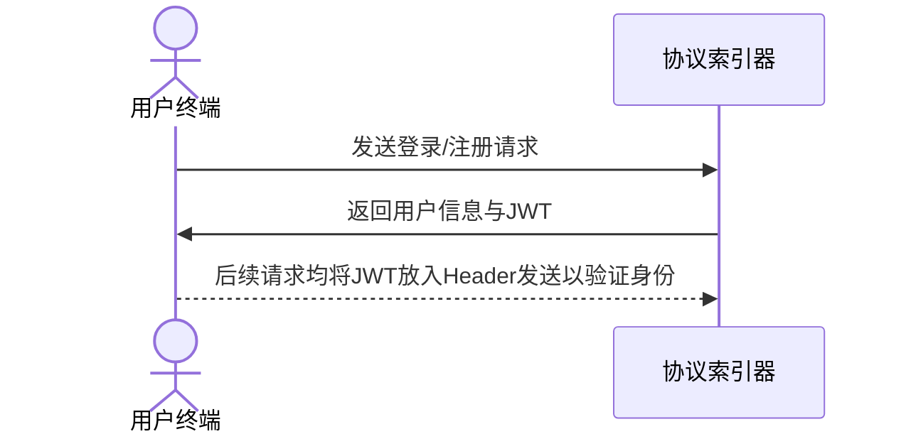
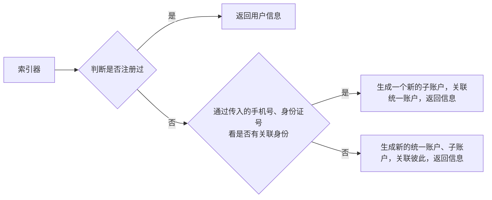

# 身份与关系

### &#x20;“统一身份验证” 机制

对于一个普通用户，深度社交协议会产生一个“统一账号”（也称作“核心账号”、“根账号”、“基本账户”），用户使用不同的生态应用时，会由统一账号生成子账号。通过这种机制，能够保证：

1. 所有用户数据会是统一联系的；
2. 各个生态应用能够独立进行用户管理操作；

<figure><figcaption>
深度社交协议设计 - 统一身份认证机制
</figcaption></figure>

一个用户的统一账户与各个子账户均会持有一个“厨号”，可以看作是一个独立用户的唯一标识。该厨号从 0 开始编号，并随着用户数量增长而增加。通俗的解释，我们希望厨号成为下一代 QQ 号 😊

### 流程：用户注册与登录

> ### \[POST] /idc/user/login

深度社交协议采用登录即注册的机制，即：

前端应用向协议索引器发送用户登录/注册信息，支持三大主要登录方法：通过微信号、手机号、账户密码登录。该接口的输入参数表如下：

<table><thead><tr><th width="226">字段名</th><th width="111">类型</th><th width="114">是否必须</th><th>含义</th></tr></thead><tbody><tr><td>method</td><td>int</td><td>是</td><td>1为微信登录，2为手机号登录，3为密码登录</td></tr><tr><td>eco_code</td><td>int</td><td>是</td><td>访问生态的编码，1为基本域，视为在登录或注册根账户。其余为生态域，会自动检测、链接或创建根账户</td></tr><tr><td>allow_register</td><td>bool</td><td></td><td>是否允许在不存在下注册新用户，当应用前端时，该值一般为 true；当登录管理后台时，该值一般为 false</td></tr><tr><td>wx_js_code</td><td>string</td><td>微信登录下必须</td><td>微信小程序前端请求到用户的登录码，传给协议索引器后，索引器再去微信服务器进行解析</td></tr><tr><td>tel</td><td>string</td><td>手机号登录下必须</td><td>在手机号登录中，用以验证的手机号码</td></tr><tr><td>tel_code</td><td>string</td><td></td><td>微信授予的手机号解析码，传给协议索引器后，索引器再去微信服务器进行解析</td></tr><tr><td>kof_id</td><td>int</td><td>密码登录下必须</td><td>登录的厨号</td></tr><tr><td>password</td><td>string</td><td>密码登录下必须</td><td>密码登录情况下：如果存在用户，则用于校验；不存在则作为设定密码</td></tr><tr><td>mbti</td><td>string</td><td></td><td>用户的 MBTI</td></tr><tr><td>address</td><td>string</td><td></td><td>用户的居住地址（用于购物、寄送奖品等）</td></tr><tr><td>inviter_id</td><td>ObjectID</td><td></td><td>邀请人的用户 ID</td></tr><tr><td>contact_method</td><td>string</td><td></td><td>用户的联系方式</td></tr><tr><td>username</td><td>string</td><td></td><td>注册情况下，用户名</td></tr><tr><td>avatar</td><td>string</td><td></td><td>注册情况下，头像 URL</td></tr><tr><td>content</td><td>string</td><td></td><td>注册情况下，签名</td></tr><tr><td>sync_out_to_in</td><td>bool</td><td></td><td>是否根据子账户，向根账户同步昵称、头像、签名等信息</td></tr><tr><td>sync_in_to_out</td><td>bool</td><td></td><td>是否根据根账户，向子账户同步昵称、头像、签名等信息</td></tr></tbody></table>

该接口的返回值如下：

| 字段名        | 类型      | 是否一定存在 | 含义                                                     |
| ---------- | ------- | ------ | ------------------------------------------------------ |
| new\_local | bool    | 是      | 是否是当前生态中，通过这次请求注册的新用户                                  |
| new\_kof   | bool    | 是      | 是否是通过这次请求注册完根账户                                        |
| jwt        | string  | 是      | JWT Token，非常重要的 Token，需要本地化保存，后续作为身份认证的 HTTP Header 传入 |
| user       | UserDTO | 是      | 用户的昵称、签名、头像等信息                                         |

### 关系

深度社交协议采用“单向”社交关联方法，即“关注”。双向关注即是好友。判断、构建与删除用户的关系是回归统一账户的。

